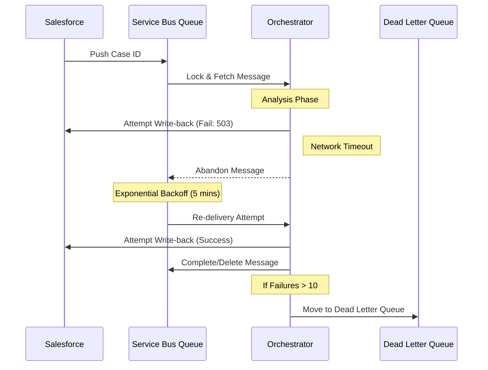

## 🛡️ Reliability & Persistence Strategy

The system is designed to handle failures at three critical points: **Ingress** (Salesforce), **Processing** (RAG/LLM), and **Egress** (Salesforce Write-back).

### 1. The Async Buffer (Azure Service Bus)
Instead of a direct synchronous call, we utilize **Azure Service Bus** as the backbone of our persistence.

* **Decoupling:** When a Case is identified in Salesforce, the event is pushed into a Service Bus Queue. This ensures that the Salesforce UI remains responsive and the agent processes work at its own pace.
* **At-Least-Once Delivery:** The Orchestrator uses "Peek-Lock" mode. The message is only deleted from the queue *after* the Salesforce "Write-back" and "Task Creation" are successfully confirmed.

### 2. Error Handling & Retry Logic
We implement an **Exponential Backoff** retry strategy to handle transient failures (e.g., Salesforce 503 errors, Network timeouts, or OpenAI rate limits).

| Failure Type | Handling Mechanism | Resolution |
| :--- | :--- | :--- |
| **Transient (5xx/429)** | Orchestrator raises Exception | Service Bus retries with increasing delays (e.g., 30s, 5m, 15m). |
| **Validation (400)** | Log & Move to DLQ | The message moves to the **Dead Letter Queue** for manual inspection. |
| **Logic/Timeout** | Pydantic Validation | System logs the data mapping error and alerts the dev team. |

### 3. Checkpointing & Idempotency
To prevent duplicate Tasks or Summaries in Salesforce during a retry, the system follows these rules:

* **Idempotency:** The `write_back` function uses the `Case ID` as a unique identifier. Subsequent patches to the `Technical_Summary__c` field overwrite previous attempts rather than creating duplicate entries.
* **State Tracking:** Before the Analysis phase, the system can optionally log the "In-Progress" status to **Azure Cosmos DB** (or a Salesforce status field) to ensure a single Case isn't processed by two concurrent agent instances.

---

## 🔄 The Failure Recovery Flow

### 4. Safety-Critical Persistence (The "Kill-Switch")
If the **RAG Engine** identifies a "Critical" sentiment but the **Egress** to Salesforce fails, the system prioritizes the external notification (Slack/Teams). Even if the Salesforce UI update is delayed, the human team is alerted immediately via an independent notification channel, ensuring safety procedures aren't stalled by a CRM outage.